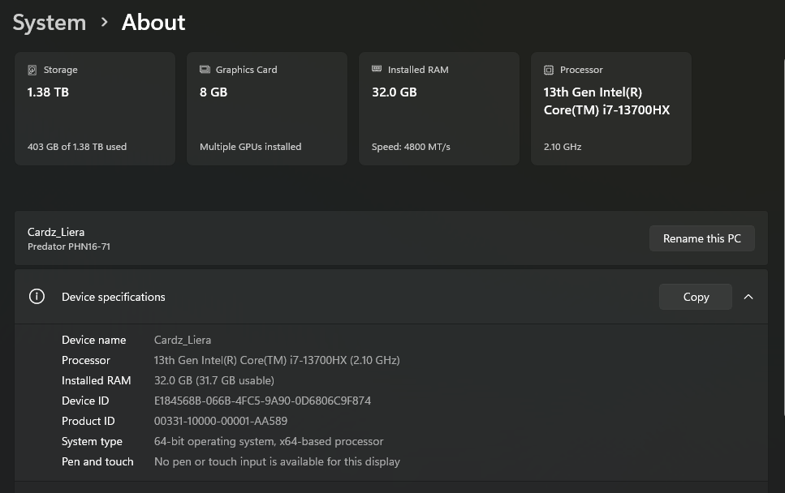

# CertKorChamNet

A web-based **Certificate of Origin Management System** developed for managing and processing Korea Chamber certificate records. The system enables users to create, edit, search, manage, and print Certificate of Origin (COO) documents through an intuitive web interface.

## Features

- 📄 Certificate of Origin Management
- ➕ Create Certificate Records
- ✏️ Edit Certificate Records
- 👁️ View Certificate Details
- 🗑️ Delete Certificate Records
- 🔍 Search and Filter Records
- 📋 DataTables Integration
- ✅ Form Validation
- 🖨️ Printable Certificate Layout
- 🔐 Secure MVC Architecture

## Tech Stack

- PHP 8.x
- CodeIgniter 3
- MySQL
- Bootstrap
- jQuery
- DataTables
- HTML5
- CSS3
- JavaScript

## Project Structure

```text
application/
├── controllers/
│   └── Entry.php
├── models/
│   └── Example_model.php
├── views/
│   ├── example_form.php
│   ├── example_list_ajax.php
│   └── example_read.php

assets/
db/
system/
uploads/
```

## Installation

### 1. Clone the Repository

```bash
git clone https://github.com/CardzLieraJr/CertKorCham-certificate-management-system_CodeIgniter.git
```

### 2. Move the Project

Copy the project to your local web server directory.

Example:

```text
C:\laragon\www\aakorcham
```

### 3. Import the Database

Import the database located at:

```text
db/aasearchsysdb.sql
```

> **Note:** If your repository contains a `.db` file instead of a `.sql` file, import the appropriate database file supported by your database system.

### 4. Configure the Database

Edit:

```text
application/config/database.php
```

Example:

```php
$db['default'] = array(
    'hostname' => 'localhost',
    'username' => 'root',
    'password' => 'root',
    'database' => 'aasearchsysdb'
);
```

### 5. Configure the Base URL

Edit:

```text
application/config/config.php
```

```php
$config['base_url'] = 'http://localhost/aakorcham/';
```

### 6. Run the Project

Open your browser:

```text
http://localhost/aakorcham
```

## Screenshots




## Future Enhancements

- User Authentication
- Role-Based Access Control (RBAC)
- PDF Export
- QR Code Verification
- Digital Signature Support
- Audit Logging
- Email Notifications
- REST API Integration
- Dashboard and Reports

## License

This project is intended for educational and internal business purposes.

## Author

**Ricardo Jr. Liera**

Full Stack Developer

- GitHub: https://github.com/CardzLieraJr
- LinkedIn: https://www.linkedin.com/in/ricardo-jr-liera-8940832a3/